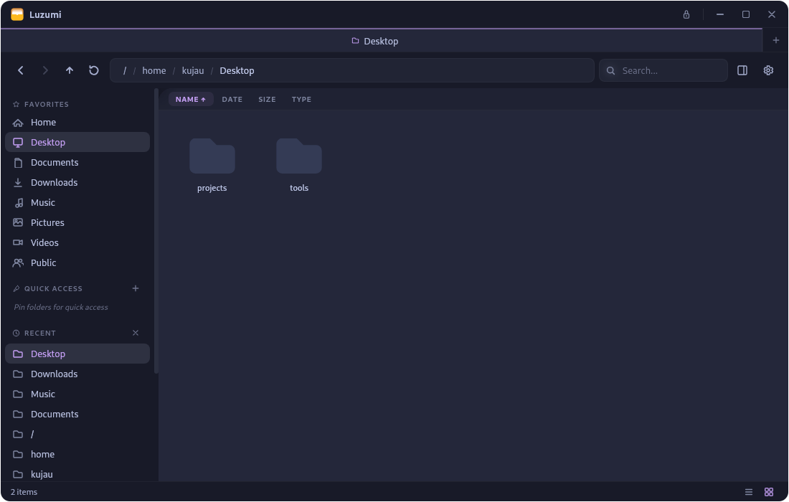

<p align="center">
  
</p>

<h1 align="center">Luzumi</h1>

<p align="center">
  <strong>A modern, fast, and beautiful file manager for Linux.</strong><br/>
  <sub>Built with <a href="https://v2.tauri.app">Tauri 2</a> + <a href="https://svelte.dev">Svelte 5</a> + <a href="https://www.rust-lang.org">Rust</a></sub>
</p>

<p align="center">
  <a href="#installation"></a>
  <a href="LICENSE"></a>
  
  
</p>

<br/>

<p align="center">
  
</p>

<br/>

> **No Electron. No bloat.** Just a thin webview powered by Tauri and a Rust backend that talks directly to your filesystem. Designed for people who want something between a terminal and Nautilus.

<br/>

## Highlights

<table>
<tr>
<td width="50%">

**Lightning fast**
- Rust backend with zero-copy file ops
- Virtual scrolling for 100k+ files
- Real-time file watching (inotify)

</td>
<td width="50%">

**Beautiful & themeable**
- Catppuccin Macchiato by default
- 40+ CSS variables for full control
- Drop-in custom themes

</td>
</tr>
<tr>
<td>

**Keyboard-driven**
- Every action has a shortcut
- Editable address bar
- Bulk rename with regex

</td>
<td>

**Secure by design**
- pkexec auto-elevation
- Multi-pass secure delete
- Input validation & path traversal protection

</td>
</tr>
</table>

<br/>

## Features

### Navigation & Views
- **Dual view modes** — Grid view with thumbnails + detailed list view
- **Tabs** — Multiple directories, `Ctrl+Tab` to switch
- **Split pane** — Side-by-side directory comparison
- **Preview pane** — Images, videos (ffmpeg thumbnails), text, and metadata
- **Breadcrumb navigation** with editable address bar
- **Virtual scrolling** — Handles massive directories smoothly

### File Operations
- Copy, move, rename, duplicate, delete with **undo/redo**
- **Cancel operations** — Stop long copy/move with progress indicator
- **Secure deletion** — Multi-pass overwrite for sensitive files
- **Archive support** — Create & extract ZIP archives
- **Bulk rename** — Find & replace, case conversion, sequential numbering
- **Duplicate file finder** — Content-hash based detection
- **Drag & drop** — Internal moves + cross-app drag via `text/uri-list`

### Filesystem & Permissions
- **Real-time file watching** — Instant detection via `notify` crate
- **Permission editing** — Visual rwx checkboxes + octal input
- **Auto-elevation** — Seamless pkexec when permission is denied
- **Symlink support** — Create, follow, and detect broken links

### Trash & Drives
- **Freedesktop Trash spec** — Full compliance with percent-encoding
- **External drive trash** — Scans `.Trash-<uid>/` on mounted volumes
- **Device management** — Mount, unmount, eject, unlock LUKS volumes
- **GVFS support** — GNOME network mounts (SMB, NFS, SSHFS)

### System Integration
- **XDG Desktop Portal** — System-wide file picker with preview pane
- **Open With** — Launch files with any installed app
- **Set as default file manager** — One-click setup
- **Open terminal here** — Launch terminal in current directory

### Icons & Preview
- **120+ file type icons** — Languages, archives, media, configs, ML models...
- **Image thumbnails** in grid view (PNG, JPG, WebP, AVIF, HEIC...)
- **Video thumbnails** via ffmpeg (MP4, MKV, AVI, MOV, WebM...)
- **Dedicated icons** for LICENSE, README, .gitignore, .env, Dockerfile...

### Customization
- **Full CSS theming** — Drop a `.css` file in `~/.config/luzumi/themes/`
- Built-in Light, Nord, Catppuccin themes
- Icon colors adapt to your palette automatically
- French & English interface

<br/>

## Installation

### From source

**Prerequisites:**
- [Rust](https://rustup.rs/) (stable)
- [Node.js](https://nodejs.org/) (v18+)
- [ffmpeg](https://ffmpeg.org/) (optional, for video thumbnails)
- System libs: `webkit2gtk-4.1`, `libappindicator3`, `librsvg2`
  (see [Tauri prerequisites](https://v2.tauri.app/start/prerequisites/))

```bash
git clone https://github.com/uScyt/luzumi.git
cd luzumi
npm install
npm run tauri build
```

The built binary will be in `src-tauri/target/release/luzumi`.
Packages (`.deb`, `.rpm`) are generated in `src-tauri/target/release/bundle/`.

### AppImage

```bash
npm run tauri build
cd scripts && chmod +x build-appimage.sh && ./build-appimage.sh
```

<br/>

## Development

```bash
npm install
npm run tauri dev
```

Hot-reload is enabled — edit Svelte components and see changes instantly. Rust changes trigger a recompile.

<br/>

## Keyboard Shortcuts

| Action | Shortcut |
|:---|:---|
| New tab | `Ctrl+T` |
| Close tab | `Ctrl+W` |
| Navigate back / forward | `Alt+Left` / `Alt+Right` |
| Go up | `Alt+Up` |
| Reload | `F5` |
| Focus address bar | `Ctrl+L` |
| Search | `Ctrl+F` |
| Select all | `Ctrl+A` |
| Copy / Cut / Paste | `Ctrl+C` / `Ctrl+X` / `Ctrl+V` |
| Delete | `Delete` |
| Rename | `F2` |
| Properties | `Ctrl+I` |
| New folder | `Ctrl+Shift+N` |
| Toggle hidden files | `Ctrl+H` |
| List / Grid view | `Ctrl+1` / `Ctrl+2` |
| Undo / Redo | `Ctrl+Z` / `Ctrl+Shift+Z` |

<br/>

## Theming

Luzumi supports custom CSS themes. Create a `.css` file in `~/.config/luzumi/themes/`, then select it in **Settings > Theme**.

See **[THEMING.md](THEMING.md)** for the full variable reference and example themes.

<br/>

## Tech Stack

| Layer | Technology |
|:---|:---|
| Backend | Rust |
| Frontend | Svelte 5 (runes) |
| Framework | Tauri 2 |
| File watching | `notify` crate (inotify) |
| Thumbnails | ffmpeg (video), base64 (images) |
| Trash spec | Freedesktop + `percent-encoding` |
| Styling | CSS custom properties (Catppuccin) |
| Packaging | `.deb`, `.rpm`, AppImage |

<br/>

## Project Structure

```
luzumi/
  src/                          # Svelte frontend
    lib/
      components/               # UI components
        VirtualScroller.svelte  # Virtual scrolling for large dirs
        FileGrid.svelte         # Grid view with thumbnails
        FileList.svelte         # Detailed list view
        PreviewPane.svelte      # Image/video/text preview
        TrashView.svelte        # Trash management
      fileManager.svelte.ts     # Core state management
      i18n.ts                   # Translations (en, fr)
      icons.ts                  # SVG icon library (120+ icons)
      types.ts                  # Types & file icon/color mapping
    App.svelte                  # Root component
    app.css                     # Theme variables & base styles
  src-tauri/                    # Rust backend
    src/
      lib.rs                    # Tauri commands & file watchers
      filesystem.rs             # File ops, trash, permissions, mounts
      desktop_apps.rs           # Application launcher
    luzumi-portal/              # XDG Desktop Portal integration
```

<br/>

## Contributing

Contributions are welcome! Feel free to open issues or submit pull requests.

<br/>

## License

MIT License — see [LICENSE](LICENSE) for details.
